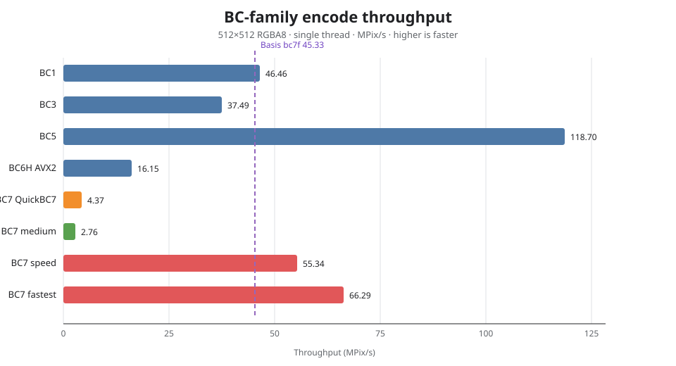

<!--
  Copyright (c) 2026 Syoyo Fujita and TinyEXR authors
  SPDX-License-Identifier: BSD-3-Clause
-->

# texcomp BC benchmark

Single-thread encode snapshot on the AMD Ryzen 9 3950X (Zen 2) benchmark host.
The workload is a 512x512 RGBA8 synthetic image, compiled with the repository's
normal optimized build. Throughput is reported in megapixels per second
(MPix/s). CPU frequency, compiler, and image content affect the result.



| codec / profile | throughput | quality snapshot |
|---|---:|---:|
| texcomp BC1 | 46.46 MPix/s | — |
| texcomp BC3 | 37.49 MPix/s | — |
| texcomp BC5 | 118.70 MPix/s | — |
| texcomp BC6H unsigned, AVX2 | 16.15 MPix/s | — |
| texcomp BC7 QuickBC7 profile | 4.37 MPix/s | 53.62 dB |
| texcomp BC7 medium | 2.76 MPix/s | 55.06 dB |
| texcomp BC7 speed, mode 6 | 55.34 MPix/s | 51.43 dB |
| texcomp BC7 fastest, mode 6 | 66.29 MPix/s | 48.94 dB |
| Basis Universal `bc7f` | 45.33 MPix/s | 41.86 dB |

The BC7 quality numbers use the benchmark's smooth 512x512 RGB gradient and
the shipped BC7 decoder. The Basis `bc7f` value is the matching earlier
reference run from checked-out Basis Universal revision `99f52d6`; it is
included as a practical analytical-transcoder reference. The texcomp QuickBC7
row is the pure-C QuickBC7-derived profile, not a claim that it is the upstream
etcpak binary.

The two mode-6 profiles are the intended real-time choices: `speed` is faster
than the Basis reference on this host, while `fastest` trades endpoint-search
quality for the highest throughput. Re-run the snapshot with:

```sh
make texcomp-bench
```

The benchmark source and compiler flags are in
[`tools/texcomp/bench/texcomp_bench.c`](../tools/texcomp/bench/texcomp_bench.c).
